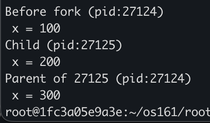

# Assignment: Practicing the Process API
Practicing with fork, exec, wait. 

### Overview

In this assignment, you will practice using the Process API to create processes and run programs under Linux. The goal is to gain hands-on experience with system calls related to process management. Specifically, you will practice using the unix process API functions 'fork()', 'exec()', 'wait()', and 'exit()'. 

⚠️ Note: This is not an OS/161 assignment. You will complete it directly on Linux. 

Use the Linux in your CSE4001 container. If you are using macOS, you may use the Terminal (you may need to install development tools with C/C++ compilers). 

**Reference Reading**: Arpaci-Dusseau, *Operating Systems: Three Easy Pieces*, Chapter 5 (Process API Basics)
 👉 [Chapter 5 PDF](http://pages.cs.wisc.edu/~remzi/OSTEP/cpu-api.pdf)

---

### **Steps to Complete the Assignment**

1. **Accept the GitHub Classroom Invitation**
    [GitHub Link](https://classroom.github.com/a/FZh4BrQG)
2. **Set up your Repository**
   - Clone the assignment repository.
3. **Study the Reference Materials**
   - Read **Chapter 5**.
   - Download and explore the sample programs from the textbook repository:
      [OSTEP CPU API Code](https://github.com/remzi-arpacidusseau/ostep-code/tree/master/cpu-api).
4. **Write Your Programs**
   - Adapt the provided example code to answer the assignment questions.
   - Each program should be clear, well-commented, and compile/run correctly.
   - Add your solution source code to the repository.

5. **Prepare Your Report**
   - Answer the questions in the README.md file. You must edit the README.md file and not create another file with the answers. 
   - For each question:
     - Include your **code**.
     - Provide your **answer/explanation**.
6. **Submit Your Work via GitHub**
   - Push both your **program code** to your assignment repository.
   - This push will serve as your submission.
   - Make sure all files, answers, and screenshots are uploaded and rendered properly.


---
### Questions
1. Write a program that calls `fork()`. Before calling `fork()`, have the main process access a variable (e.g., x) and set its value to something (e.g., 100). What value is the variable in the child process? What happens to the variable when both the child and parent change the value of x?

A. Before the fork, the original process prints x = 100. After the fork, the child prints x = 200 and the parent prints x = 300. This shows us that each process has its own separate copy of x.

```cpp
// p1
#include <stdio.h>
#include <stdlib.h>
#include <unistd.h>
#include <sys/wait.h>

int main(void) {
	int x = 100;

	printf("Before fork (pid:%d)\n x = %d\n", (int) getpid(), x);
	int rc = fork();
	if (rc < 0) {
		fprintf(stderr, "fork failed\n"); // fork failed
		exit(1);
	} else if (rc == 0) { // childs path
		x = 200; // change childs copy
		printf("Child (pid:%d)\n x = %d\n", (int) getpid(), x); // child (new process)
	} else { // parents path
		x = 300; // change parents copy
		int rc_wait = wait(NULL);
		printf("Parent of %d (pid:%d) \n x = %d\n",
			rc_wait, (int) getpid(), x);
	}

	return 0;
} 
```


2. Write a program that opens a file (with the `open()` system call) and then calls `fork()` to create a new process. Can both the child and parent access the file descriptor returned by `open()`? What happens when they are writing to the file concurrently, i.e., at the same time?

```cpp
// p2

```

3. Write another program using `fork()`.The child process should print “hello”; the parent process should print “goodbye”. You should try to ensure that the child process always prints first; can you do this without calling `wait()` in the parent?

A. After the fork is created, the child immediately prints "hello". The parent waits one second before printing "goodbye". This shows us that sleep() can be used as a buffer between outputs without needing wait().

```cpp
// p3
#include <stdio.h>
#include <stdlib.h>
#include <unistd.h>

int main(void) {
	int rc = fork();
	if (rc < 0) {
		fprintf(stderr, "fork failed\n");
		exit(1);
	}

	if (rc == 0) {
		printf("hello\n");
	} else {
		sleep(1);
		printf("goodbye\n");
	}
	return 0;
}
```


4. Write a program that calls `fork()` and then calls some form of `exec()` to run the program `/bin/ls`. See if you can try all of the variants of `exec()`, including (on Linux) `execl()`, `execle()`, `execlp()`, `execv()`, `execvp()`, and `execvpe()`. Why do you think there are so many variants of the same basic call?

A. After the fork is created, the child calls execv() to replace itself with the /bin/ls program. There are so many variants of exec because different programs need different ways to pass arguments.

```cpp
// p4.c
#include <stdio.h>
#include <stdlib.h>
#include <unistd.h>
#include <sys/wait.h>

int main(void) {
	int rc = fork();
	if (rc < 0) {
		fprintf(stderr, "fork failed\n");
		exit(1);
	}

	if (rc == 0) { // child replaces itself with /bin/ls
		char *argv[] = {"ls", NULL};
		execv("/bin/ls", argv);
		fprintf(stderr, "execv failed\n"); // prints if execv fails
		exit(1);
	} else { // parent: waits for child
		wait(NULL);
	}
	return 0;
} 
```

5. Now write a program that uses `wait()` to wait for the child process to finish in the parent. What does `wait()` return? What happens if you use `wait()` in the child?

A. After the fork is created, the parent calls wait(NULL) to pause until the child finishes. This shows us that wait() allows a parent to know when its child has completed its process, and which child it was. 

```cpp
// p5
#include <stdio.h>
#include <stdlib.h>
#include <unistd.h>
#include <sys/wait.h>

int main(void) {
	int rc = fork();
	if (rc < 0) {
		fprintf(stderr, "fork failed\n");
		exit(1);
	} else if (rc == 0) { // child path
		printf("child is running\n");
		exit(0);
	} else { // parent path
		int rc_wait = wait(NULL); // wait for the child to finish
		printf("parent (pid:%d) waited for child (pid:%d)\n", (int)getpid(), rc_wait);
	}
	return 0;
}
```

6. Write a slight modification of the previous program, this time using `waitpid()` instead of `wait()`. When would `waitpid()` be useful?

```cpp
// Add your code or answer here. You can also add screenshots showing your program's execution.  
```

7. Write a program that creates a child process, and then in the child closes standard output (`STDOUT FILENO`). What happens if the child calls `printf()` to print some output after closing the descriptor?

```cpp
// Add your code or answer here. You can also add screenshots showing your program's execution.  
```

